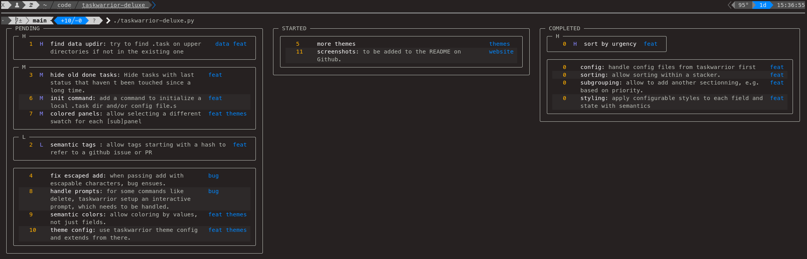
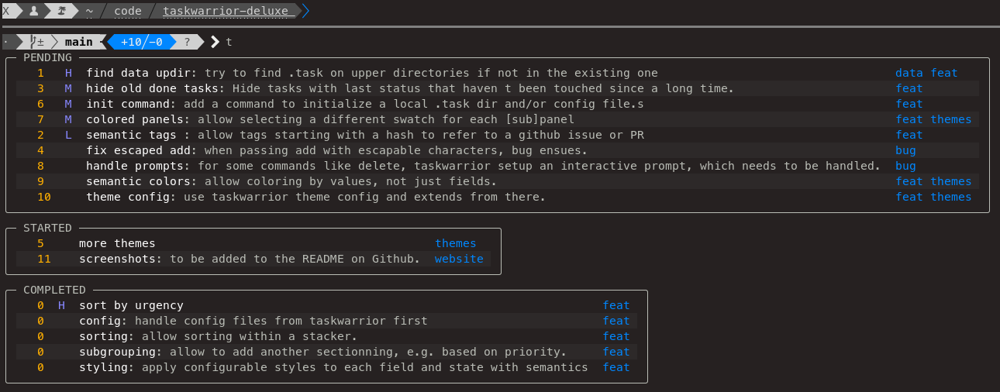
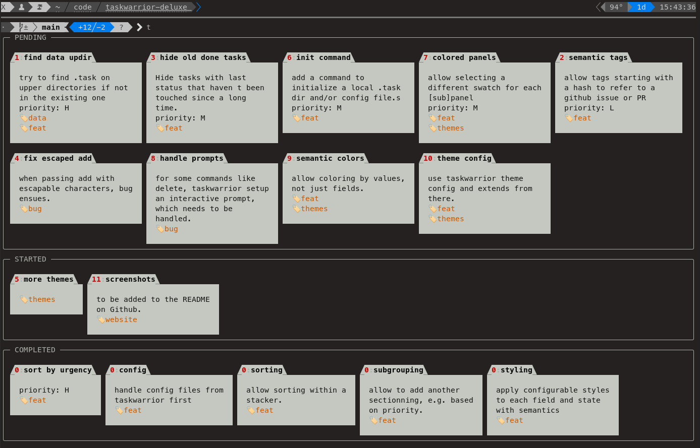
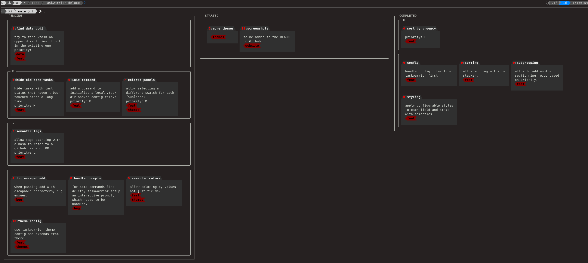

Taskwarrior-deluxe is a wrapper for the [Taskwarrior](https://taskwarrior.org/) task manager.

Taskwarrior-deluxe aims at being a proof of concept of how the task display may be better than the current one.

It essentially features:
- a fancier output, allowing better (i.e. more readable and/or good looking) ways to display tasks than the original table:
    - it allows grouping of tasks having the same metadata (for instance, the same status),
    - it actually provides several ways to display the tasks, with a modular set of widgets, so that you can setup a Kanban board or a regular table, along with managing if tasks are table lines or fancy cards.
- the possibility to work with task repositories attached to directories, in the same spirit than a version control system:
    - it looks if the current (or a parent) directory have a task database, and works from there,
    - thanks to Taskwarrior's design, the database can be versionned in the VCS repository (cf. Taskwarrior-deluxe's own Git repository).

Taskwarrior-deluxe is in early ~~aplha~~ ~~alhpa~~ alpha stage and not ready for production.

